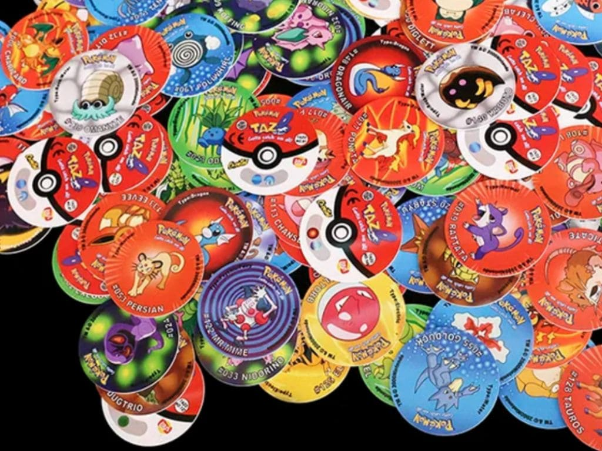

# TAREA 4

- Hacer algo análogo a: Encontrar centros de objetos circulares de imágenes de Internet o tomadas por el alumno.

Se utilizó la siguiente imagen

* Archivo de clase
[Notebook en Google colab](./tarea4.ipynb)
[Clase4](./Clase4.ipynb)